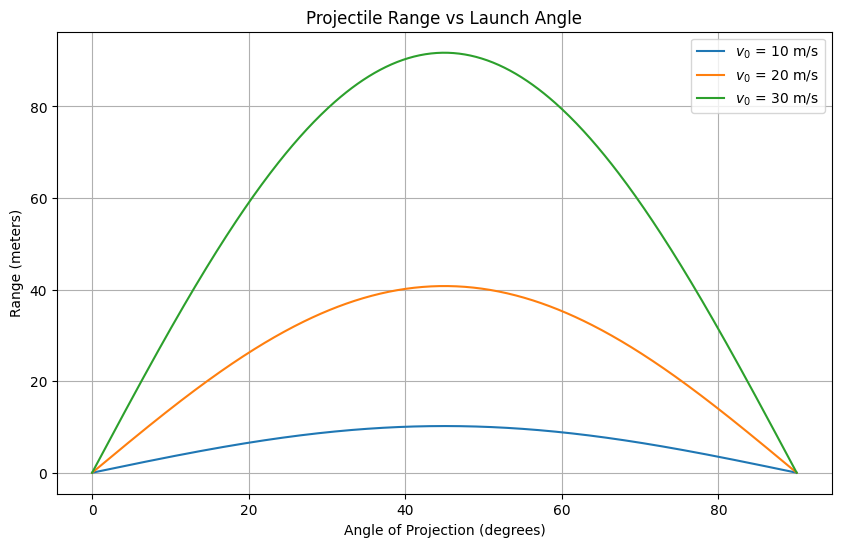
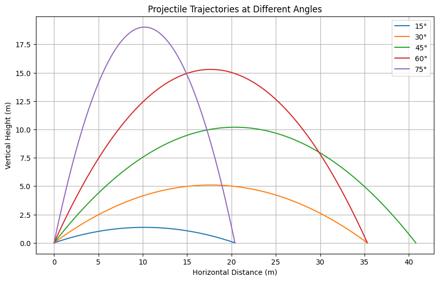
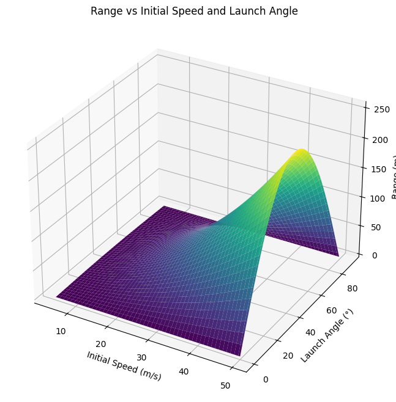

# Problem 1
# 1. Theoretical Foundation

## Governing Equations

Assume the projectile is launched from ground level with:

- Initial speed: $v_0$
- Angle of projection: $\theta$
- Gravitational acceleration: $g$

We decompose the motion:

- Horizontal velocity: $v_{x0} = v_0 \cos\theta$
- Vertical velocity: $v_{y0} = v_0 \sin\theta$

Using kinematic equations:

- Horizontal displacement:
  $$
  x(t) = v_0 \cos\theta \cdot t
  $$

- Vertical displacement:
  $$
  y(t) = v_0 \sin\theta \cdot t - \frac{1}{2} g t^2
  $$

### Time of Flight

At ground level, $y(t) = 0$ (excluding $t = 0$):

$$
t = \frac{2 v_0 \sin\theta}{g}
$$

### Range

$$
R = x(t) = v_0 \cos\theta \cdot \frac{2 v_0 \sin\theta}{g} = \frac{v_0^2 \sin(2\theta)}{g}
$$

This function is maximized when $\sin(2\theta) = 1$, i.e., $\theta = 45^\circ$.

---

# 2. Analysis of the Range

We explore how the range $R$ varies with $\theta$, $v_0$, and $g$.

**Key Observations:**

- Range is symmetric around $\theta = 45^\circ$
- Higher $v_0$ increases range **quadratically**
- Higher $g$ decreases range

---

# 3. Practical Applications

- **Sports**: Calculating optimal angles for kicks, throws, or jumps.
- **Engineering**: Determining launch angles for projectiles or missiles.
- **Astrophysics**: Predicting paths of objects under planetary gravity.

### Realistic Extensions

- **Air resistance**: Add non-linear drag force, $F_d \propto v^2$
- **Uneven terrain**: Replace flat ground $y=0$ with a function $y(x)$
- **Wind**: Adds a horizontal force component

---

# 4. Implementation (Python)

```python
import numpy as np
import matplotlib.pyplot as plt

# Parameters
v0_list = [10, 20, 30]   # m/s
g = 9.81                 # m/s^2
angles = np.linspace(0, 90, 500)  # degrees
theta_rad = np.radians(angles)

# Plot range vs angle for multiple velocities
plt.figure(figsize=(10, 6))
for v0 in v0_list:
    R = (v0 ** 2) * np.sin(2 * theta_rad) / g
    plt.plot(angles, R, label=f'v₀ = {v0} m/s')

plt.title('Projectile Range vs Launch Angle')
plt.xlabel('Angle of Projection (degrees)')
plt.ylabel('Range (meters)')
plt.legend()
plt.grid(True)
plt.show()


```






# colab 
[problems](https://colab.research.google.com/drive/1aM85uqywObWsXi52t-UJpsuy9hHq8RIQ?usp=sharing)