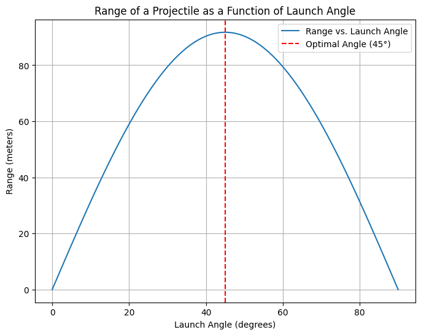
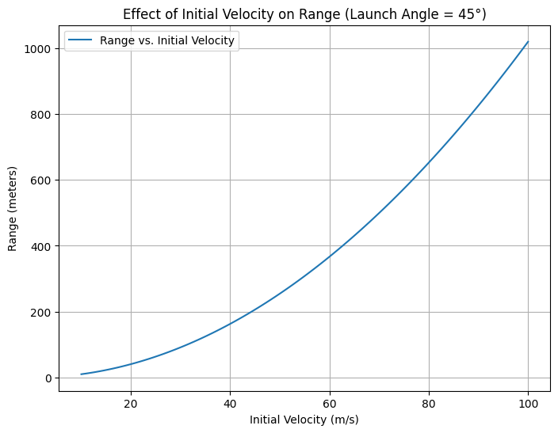
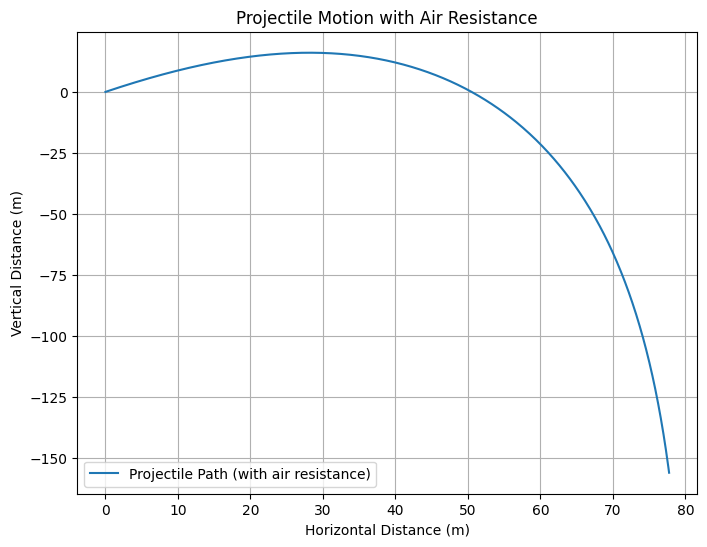

 # Problem 1 # Investigating the Range as a Function of the Angle of Projection

## 1. Theoretical Foundation: Deriving the Equations of Motion

### Key Assumptions:
- The projectile is launched from a flat surface.
- There is no air resistance.
- The gravitational field is uniform (i.e., $g$ is constant).
- The angle of projection is $\theta$.
- The initial velocity is $v_0$.

### Governing Equations:

To describe the projectile’s motion, we separate it into two components: horizontal and vertical motion.

#### Horizontal Motion:
There is no acceleration in the horizontal direction (ignoring air resistance), so the horizontal displacement at any time $t$ is given by:

$$
x(t) = v_0 \cos(\theta) \cdot t
$$

where:
- $x(t)$ is the horizontal displacement at time $t$,
- $v_0 \cos(\theta)$ is the horizontal component of the initial velocity,
- $t$ is the time.

#### Vertical Motion:
The vertical motion is influenced by gravity, so the vertical displacement at any time $t$ is given by:

$$
y(t) = v_0 \sin(\theta) \cdot t - \frac{1}{2} g t^2
$$

where:
- $y(t)$ is the vertical displacement at time $t$,
- $v_0 \sin(\theta)$ is the vertical component of the initial velocity,
- $g$ is the acceleration due to gravity ($\approx 9.81 \, \text{m/s}^2$).

#### Time of Flight:
The time of flight $T$ is the time it takes for the projectile to reach the ground. This occurs when $y(t) = 0$, so we solve the vertical motion equation:

$$
y(t) = v_0 \sin(\theta) \cdot t - \frac{1}{2} g t^2 = 0
$$

Factorizing:

$$
t \left( v_0 \sin(\theta) - \frac{1}{2} g t \right) = 0
$$

The non-zero solution is:

$$
t = \frac{2 v_0 \sin(\theta)}{g}
$$

Thus, the time of flight is:

$$
T = \frac{2 v_0 \sin(\theta)}{g}
$$

#### Range of the Projectile:
The range $R$ is the horizontal distance traveled by the projectile when it reaches the ground. It is given by the horizontal displacement at the time of flight:

$$
R = x(t) = v_0 \cos(\theta) \cdot T
$$

Substituting $T$:

$$
R = v_0 \cos(\theta) \cdot \frac{2 v_0 \sin(\theta)}{g}
$$

Simplifying:

$$
R = \frac{v_0^2}{g} \sin(2\theta)
$$

Thus, the range $R$ is:

$$
R = \frac{v_0^2}{g} \sin(2\theta)
$$

## 2. Analysis of the Range

The range depends on the following parameters:
- **Initial velocity** ($v_0$): The range increases as the initial velocity increases. The relationship is quadratic, meaning if you double the initial velocity, the range quadruples.
- **Angle of projection** ($\theta$): The range is a function of the sine of twice the angle of projection, $\sin(2\theta)$. This function reaches its maximum value of 1 when $\theta = 45^\circ$. Therefore, the optimal angle for maximum range is $45^\circ$.
- **Gravitational acceleration** ($g$): The range is inversely proportional to gravity. If the gravitational acceleration is higher (e.g., on a planet with stronger gravity), the range decreases.

### Range vs. Angle:
- At $\theta = 0^\circ$ (horizontal launch): The projectile doesn’t rise, so the range is zero.
- At $\theta = 90^\circ$ (vertical launch): The projectile goes straight up and comes straight down, so again the range is zero.
- At $\theta = 45^\circ$: The range is maximized. This is the optimal launch angle for maximum horizontal distance.

The range as a function of $\theta$ follows a symmetric curve, with the maximum range occurring at $\theta = 45^\circ$.

## 3. Practical Applications

While the idealized model works well in a vacuum or on Earth, in real-world situations, we often need to consider additional factors:

- **Air Resistance**: In the presence of air resistance, the range will be reduced. Air resistance acts opposite to the direction of motion, slowing down the projectile. The equation of motion would become more complex, requiring numerical methods to solve.
- **Wind**: Wind would affect the trajectory of the projectile by adding horizontal forces. This would change the optimal angle of projection and also modify the range.
- **Uneven Terrain**: If the projectile is launched from an elevated position or lands on uneven terrain, the equations would need to be adjusted to reflect the initial and final heights. In this case, the projectile might not land at $y = 0$, and we’d need to solve for the time of flight and the range accordingly.
- **Real-World Projectiles**: For objects like a soccer ball or a rocket, we need to consider factors like spin, drag coefficient, and variable wind conditions.

## 4. Limitations of the Idealized Model

This model is an idealized approximation and does not consider:
- **Air Resistance**: In reality, air resistance (drag) affects the speed of the projectile, particularly for objects moving at high speeds or over long distances. The projectile’s range would be less than predicted by the idealized model.
- **Wind**: Wind introduces an additional force that alters the trajectory.
- **Launch Height**: If the projectile is launched from an elevated position (e.g., a cliff), the range equation would change.

## 5. Summary of Key Insights
- The optimal angle for maximum range in projectile motion is $45^\circ$.
- The range is directly proportional to the initial velocity squared ($R \propto v_0^2$).
- The range is inversely proportional to gravity ($R \propto \frac{1}{g}$).
- In the real world, air resistance and wind will modify the idealized prediction, reducing the actual range.
- The launch height and terrain also affect the range, requiring adjustments to the basic model.

## Conclusion

Projectile motion offers a simple yet powerful model to analyze how a projectile behaves under the influence of gravity. By varying initial conditions such as launch velocity, angle, and gravity, we can predict the range and trajectory. However, for real-world applications, we must account for complexities such as air resistance, wind, and uneven terrain.

## colab c
[problems](https://colab.research.google.com/drive/1iBWUYRk0QN1CEQ_U9ZlV32IZq9PVSaLw?usp=sharing)