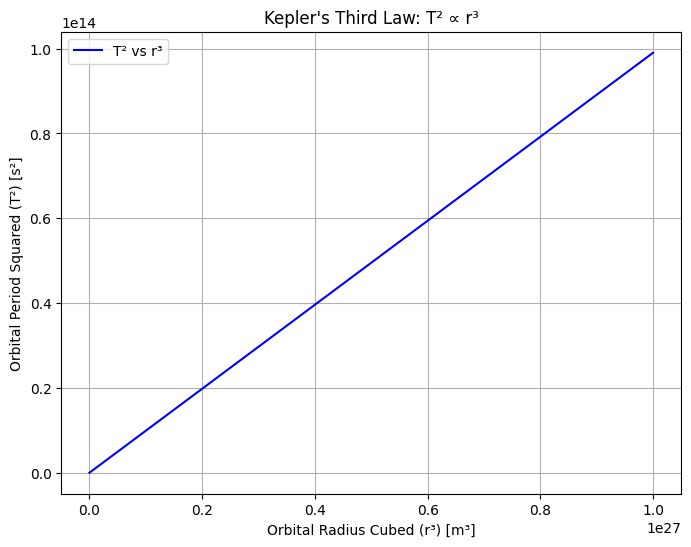
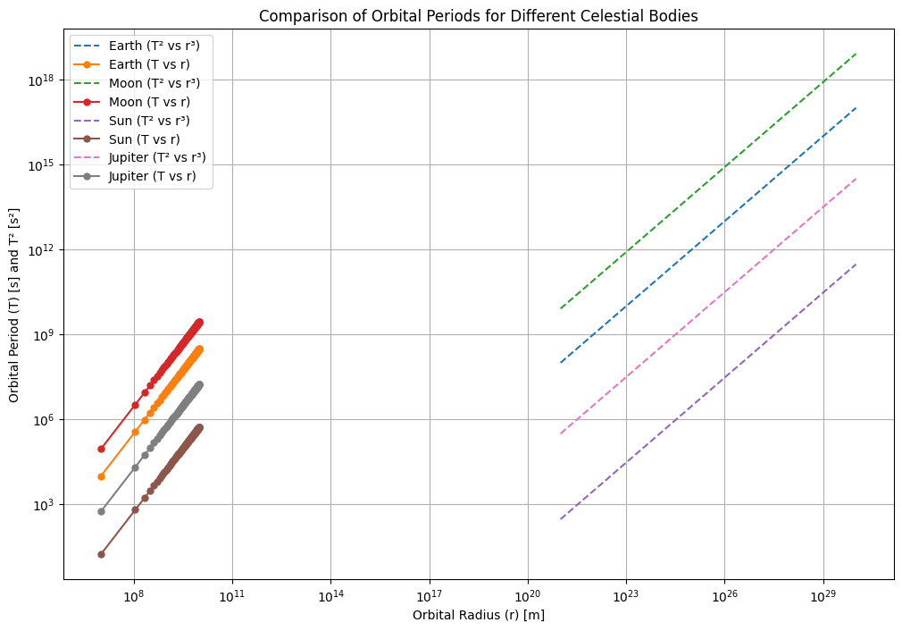

# Problem 1 # Orbital Period and Orbital Radius

## 1. Derivation of the Relationship Between the Orbital Period and Orbital Radius for Circular Orbits

The fundamental force that governs orbital motion is gravity. To derive the relationship between the orbital period $T$ (the time it takes for a body to complete one orbit) and the orbital radius $r$ (the distance between the two bodies), we can use Newton’s Law of Universal Gravitation and centripetal force.

### Step 1: Newton’s Law of Universal Gravitation
The gravitational force $F_g$ between two masses $M$ and $m$ separated by a distance $r$ is given by:

$$\[
F_g = \frac{GMm}{r^2}
\]$$

where:

- $G$ is the gravitational constant ($G \approx 6.674 \times 10^{-11} \, \text{Nm}^2 / \text{kg}^2$),
- $M$ is the mass of the central body (e.g., the Sun or Earth),
- $m$ is the mass of the orbiting object (e.g., a planet or satellite),
- $r$ is the orbital radius.

### Step 2: Centripetal Force for Circular Orbits
An object in a circular orbit experiences a centripetal force $F_c$ that keeps it moving in a circular path. The centripetal force required to keep an object of mass $m$ moving with velocity $v$ along a circular path of radius $r$ is:

$$\[
F_c = \frac{mv^2}{r}
\]$$

For an object to stay in orbit, the gravitational force must equal the centripetal force. Therefore, we set $F_g = F_c$:

$$\[
\frac{GMm}{r^2} = \frac{mv^2}{r}
\]$$

We can cancel $m$ from both sides:

$$\[
\frac{GM}{r^2} = \frac{v^2}{r}
\]$$

Multiplying both sides by $r$, we get:

$$\[
\frac{GM}{r} = v^2
\]$$

Thus, the orbital velocity $v$ of an object is:

$$\[
v = \sqrt{\frac{GM}{r}}
\]$$

### Step 3: Orbital Period and Orbital Velocity
The orbital period $T$ is the time it takes for an object to complete one full revolution around the central body. The distance traveled in one orbit is the circumference of the circle, $2 \pi r$. Therefore, the orbital period is:

$$\[
T = \frac{\text{Circumference}}{\text{Velocity}} = \frac{2 \pi r}{v}
\]$$

Substituting the expression for $v$ from above:

$$\[
T = \frac{2 \pi r}{\sqrt{\frac{GM}{r}}}
\]$$

Simplifying this:

$$\[
T = 2 \pi \sqrt{\frac{r^3}{GM}}
\]$$

### Step 4: Kepler's Third Law
This equation shows that the orbital period $T$ is proportional to the $3/2$ power of the orbital radius $r$:

$$\[
T^2 \propto r^3
\]$$

This is Kepler's Third Law of Planetary Motion, which states that the square of the orbital period is directly proportional to the cube of the orbital radius.

Thus, for circular orbits:

$$\[
T^2 = \frac{4 \pi^2}{GM} r^3
\]$$

This equation can be used to calculate the orbital period of any object given the mass of the central body $M$ and the orbital radius $r$.

## 2. Implications of Kepler’s Third Law

Kepler’s Third Law has significant implications in astronomy and celestial mechanics:

### Determining the Mass of a Celestial Body
If we know the orbital period $T$ and the orbital radius $r$ of an object orbiting a body (e.g., a satellite orbiting Earth or a planet orbiting the Sun), we can rearrange the formula to solve for the mass $M$ of the central body:

$$\[
M = \frac{4 \pi^2 r^3}{G T^2}
\]$$

This is how astronomers can calculate the mass of celestial bodies, such as planets or stars, using their moons or satellites as reference objects.

### Calculating Distances
Kepler’s Third Law also allows us to calculate the orbital radius $r$ (the average distance between two bodies) if we know the orbital period $T$ and the mass of the central body $M$.

### Consistency in Planetary Motion
Kepler’s law holds true for all planets in our Solar System and for moons orbiting planets, showing a fundamental pattern in how bodies interact under gravity.

## 3. Real-World Examples

### The Moon’s Orbit Around Earth
The orbital period of the Moon around the Earth is about 27.3 days (sidereal month). The orbital radius (average distance from Earth to the Moon) is about 384,400 km. Using Kepler’s Third Law, we can calculate the mass of the Earth or confirm the validity of the relationship by plugging these values into the equation.

### The Orbits of Planets in the Solar System
Kepler’s Third Law also allows us to analyze the orbital periods and distances of the planets in our Solar System. For instance:

- Earth has an orbital radius of 1 AU (astronomical unit, approximately 149.6 million kilometers) and an orbital period of about 365.25 days.
- Jupiter, being farther from the Sun, has a much longer orbital period (around 11.86 years), and a significantly larger orbital radius (around 5.2 AU).

Kepler's Third Law predicts this relationship between orbital period and orbital radius, and by applying the formula, one can verify the consistency of the planetary system.

## 4. Extending to Elliptical Orbits
Kepler’s Third Law also applies to elliptical orbits, though with a slight modification. For elliptical orbits, the relationship between the orbital period $T$ and the semi-major axis $a$ (the average orbital radius) still follows the same general form:

$$\[
T^2 \propto a^3
\]$$

where $a$ is the semi-major axis of the ellipse (half of the longest diameter of the ellipse). The orbital period depends on the average distance of the orbiting body from the central body, not the instantaneous distance.

## 5. Computational Model (Conceptual Approach)

To verify the relationship between orbital period and radius computationally, you would simulate circular orbits. Here's how the model would work conceptually:

- **Input**: The central body’s mass $M$, and the orbital radius $r$.
- **Compute**: Using the derived equation for the orbital period:

$$\[
T = 2 \pi \sqrt{\frac{r^3}{GM}}
\]$$

- **Plot**: Graph the orbital period $T$ as a function of the orbital radius $r$, and verify the relationship $T^2 \propto r^3$.

### Graphical Representation
For a visual representation, you would plot $T^2$ (the square of the period) against $r^3$ (the cube of the orbital radius). The plot should show a linear relationship, confirming the $T^2 \propto r^3$ relationship.

## 6. Conclusion

Kepler's Third Law is a powerful tool for understanding the motion of celestial bodies. By analyzing the relationship between the orbital period and orbital radius, we gain insight into how planetary systems and satellites behave under gravitational influence. This law allows astronomers to determine the mass of planets, moons, and stars and provides the foundation for predicting orbital dynamics in both circular and elliptical orbits.

### Limitations and Extensions:
- **Non-circular Orbits**: The law applies directly to circular orbits but can be adapted for elliptical orbits using the semi-major axis.
- **Relativity**: For extremely large gravitational fields (like those near black holes), relativistic effects may need to be considered, which slightly modify Kepler's law.

## colab 
[problems](https://colab.research.google.com/drive/1iBWUYRk0QN1CEQ_U9ZlV32IZq9PVSaLw?usp=sharing)

