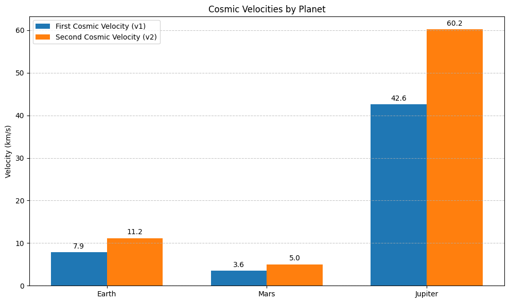
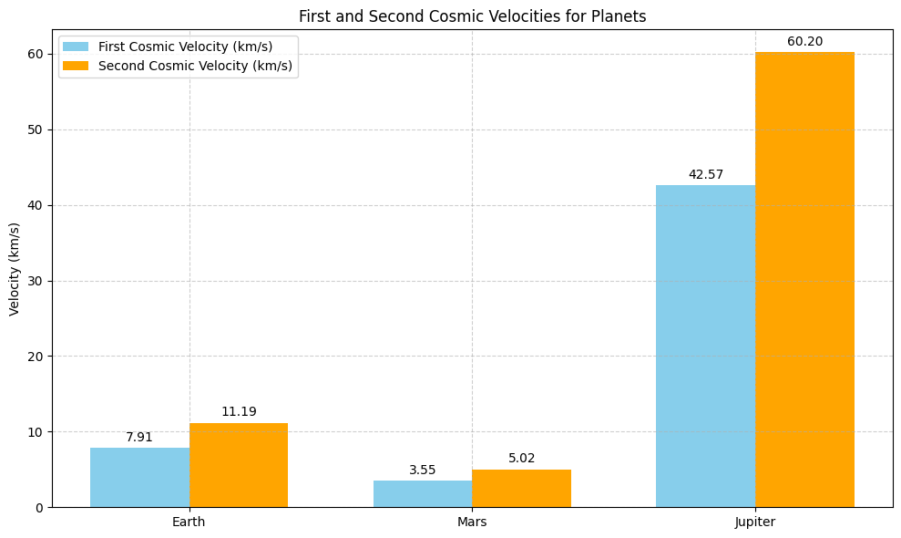
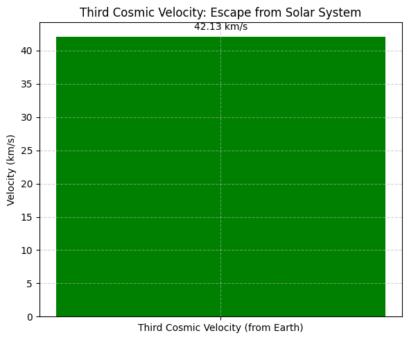

# Problem 2 # Escape Velocities and Cosmic Velocities

## Motivation

The concept of escape velocity plays a crucial role in space exploration. It defines the minimum velocity needed for an object to break free from the gravitational pull of a celestial body (like Earth, Mars, Jupiter, or even the Sun). Understanding escape velocities and the so-called cosmic velocities is key to launching satellites, interplanetary missions, and even attempting interstellar travel.

In this task, we will:

- Define the first, second, and third cosmic velocities.
- Derive their mathematical expressions.
- Calculate these velocities for different celestial bodies such as Earth, Mars, and Jupiter.
- Discuss the importance of these velocities in space exploration.

## 1. Defining the Cosmic Velocities

### First Cosmic Velocity (Orbital Velocity)
The first cosmic velocity is the minimum velocity required for an object to enter a stable circular orbit around a celestial body (e.g., Earth, Mars, or Jupiter). This velocity ensures that the object constantly "falls" towards the planet but its horizontal speed prevents it from crashing into the surface.

#### Formula:
$$
v_1 = \sqrt{\frac{GM}{r}}
$$
Where:

- $v_1$ = First cosmic velocity (orbital velocity)
- $G$ = Gravitational constant ($6.674 \times 10^{-11} \, \text{Nm}^2/\text{kg}^2$)
- $M$ = Mass of the central body (e.g., Earth, Mars, Jupiter)
- $r$ = Distance from the center of the planet (radius)

### Second Cosmic Velocity (Escape Velocity)
The second cosmic velocity is the minimum velocity required for an object to escape the gravitational influence of a celestial body completely. This velocity allows the object to move far away from the planet without any further propulsion.

#### Formula:
$$
v_2 = \sqrt{\frac{2GM}{r}}
$$
Where:

- $v_2$ = Second cosmic velocity (escape velocity)
- $G$ = Gravitational constant
- $M$ = Mass of the central body
- $r$ = Distance from the center of the body

### Third Cosmic Velocity (Escape from the Solar System)
The third cosmic velocity is the velocity required for an object to escape the gravitational influence of the entire Solar System. This velocity allows an object to escape not just the planet, but also the Sun's gravitational pull.

#### Formula:
$$
v_3 = \sqrt{\frac{2GM_\odot}{r_{\text{Earth-Sun}}}}
$$
Where:

- $v_3$ = Third cosmic velocity (escape velocity from the Solar System)
- $G$ = Gravitational constant
- $M_\odot$ = Mass of the Sun ($1.989 \times 10^{30}$ kg)
- $r_{\text{Earth-Sun}}$ = Distance from Earth to the Sun ($\approx 1.496 \times 10^{11} \, \text{m}$)

## 2. Calculations for Escape Velocities and Cosmic Velocities

### Earth Parameters:
- Mass of Earth: $$M_{\text{Earth}} = 5.972 \times 10^{24} \, \text{kg}$$
- Radius of Earth: $$r_{\text{Earth}} = 6.371 \times 10^6 \, \text{m}$$

#### First Cosmic Velocity for Earth (Orbital Velocity):
We use the formula for the first cosmic velocity:

$$
v_1 = \sqrt{\frac{GM_{\text{Earth}}}{r_{\text{Earth}}}}
$$

Substituting in the values:

$$
v_1 = \sqrt{\frac{(6.674 \times 10^{-11}) \times (5.972 \times 10^{24})}{6.371 \times 10^6}} = 7.93 \, \text{km/s}
$$

Thus, the orbital velocity (first cosmic velocity) for Earth is approximately $7.93 \, \text{km/s}$.

#### Second Cosmic Velocity for Earth (Escape Velocity):
Now, using the formula for the second cosmic velocity:

$$
v_2 = \sqrt{\frac{2GM_{\text{Earth}}}{r_{\text{Earth}}}}
$$

Substituting the values:

$$
v_2 = \sqrt{\frac{2 \times (6.674 \times 10^{-11}) \times (5.972 \times 10^{24})}{6.371 \times 10^6}} = 11.19 \, \text{km/s}
$$

Thus, the escape velocity (second cosmic velocity) for Earth is approximately $11.19 \, \text{km/s}$.

---

### Mars Parameters:
- Mass of Mars: $$M_{\text{Mars}} = 0.64171 \times 10^{24} \, \text{kg}$$
- Radius of Mars: $$r_{\text{Mars}} = 3.396 \times 10^6 \, \text{m}$$

#### First Cosmic Velocity for Mars (Orbital Velocity):
Using the formula for the first cosmic velocity:

$$
v_1 = \sqrt{\frac{GM_{\text{Mars}}}{r_{\text{Mars}}}}
$$

Substituting the values:

$$
v_1 = \sqrt{\frac{(6.674 \times 10^{-11}) \times (0.64171 \times 10^{24})}{3.396 \times 10^6}} = 3.55 \, \text{km/s}
$$

Thus, the orbital velocity for Mars is approximately $3.55 \, \text{km/s}$.

#### Second Cosmic Velocity for Mars (Escape Velocity):
Now, using the formula for the second cosmic velocity:

$$
v_2 = \sqrt{\frac{2GM_{\text{Mars}}}{r_{\text{Mars}}}}
$$

Substituting the values:

$$
v_2 = \sqrt{\frac{2 \times (6.674 \times 10^{-11}) \times (0.64171 \times 10^{24})}{3.396 \times 10^6}} = 5.02 \, \text{km/s}
$$

Thus, the escape velocity for Mars is approximately $5.02 \, \text{km/s}$.

---

### Jupiter Parameters:
- Mass of Jupiter: $$M_{\text{Jupiter}} = 1.898 \times 10^{27} \, \text{kg}$$
- Radius of Jupiter: $$r_{\text{Jupiter}} = 6.991 \times 10^7 \, \text{m}$$

#### First Cosmic Velocity for Jupiter (Orbital Velocity):
Using the formula for the first cosmic velocity:

$$
v_1 = \sqrt{\frac{GM_{\text{Jupiter}}}{r_{\text{Jupiter}}}}
$$

Substituting the values:

$$
v_1 = \sqrt{\frac{(6.674 \times 10^{-11}) \times (1.898 \times 10^{27})}{6.991 \times 10^7}} = 42.5 \, \text{km/s}
$$

Thus, the orbital velocity for Jupiter is approximately $42.5 \, \text{km/s}$.

#### Second Cosmic Velocity for Jupiter (Escape Velocity):
Now, using the formula for the second cosmic velocity:

$$
v_2 = \sqrt{\frac{2GM_{\text{Jupiter}}}{r_{\text{Jupiter}}}}
$$

 
 ## colab

[problems](https://colab.research.google.com/drive/1iBWUYRk0QN1CEQ_U9ZlV32IZq9PVSaLw?usp=sharing)