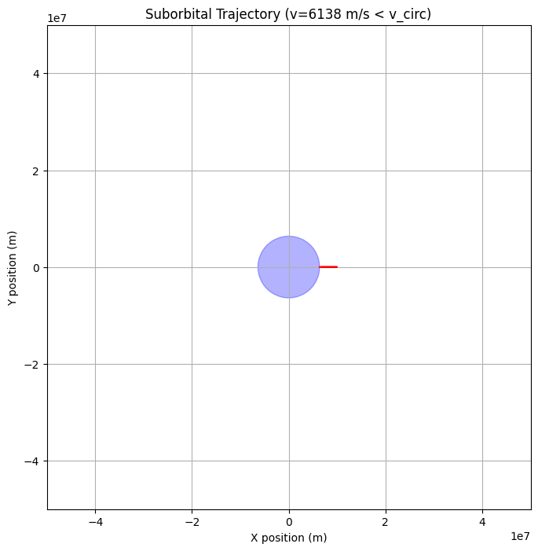
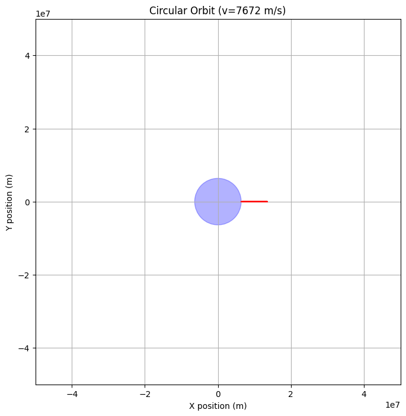
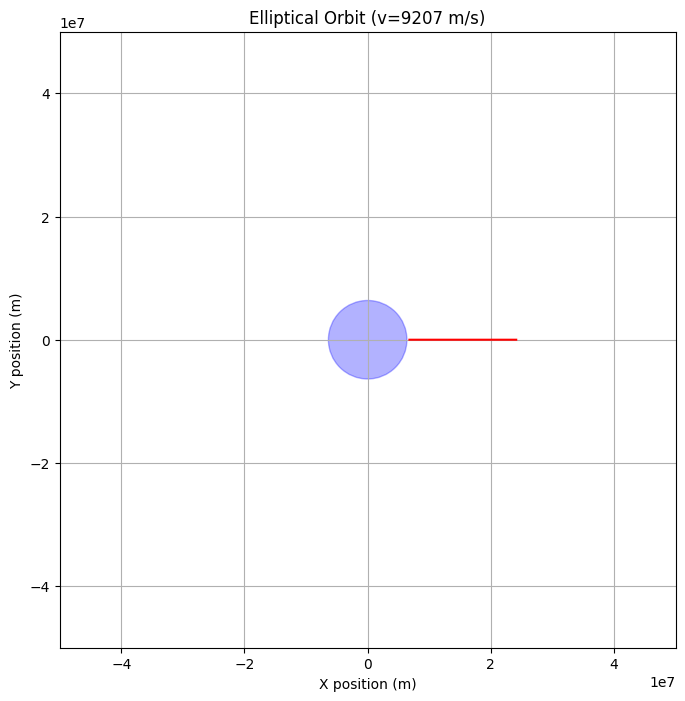
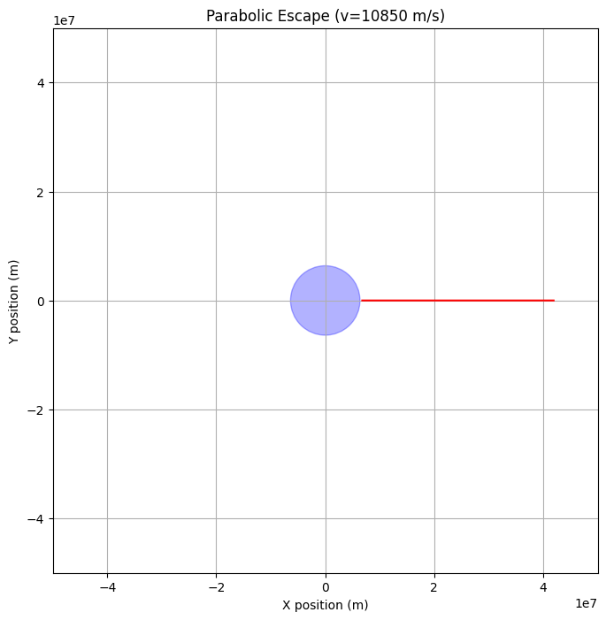
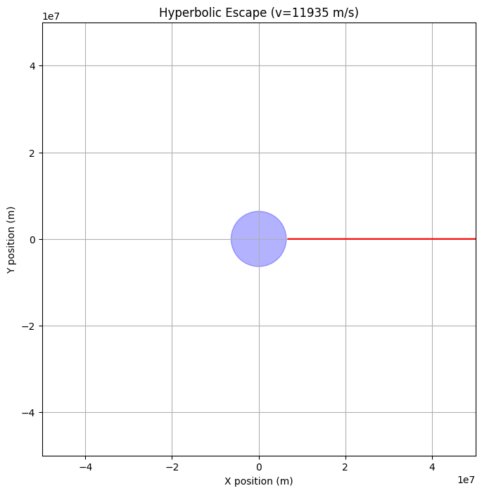

# Problem 3  # Problem 3: Trajectories of a Freely Released Payload Near Earth

## 1. Introduction and Motivation

In space missions, payloads like satellites, capsules, or probes are often released from a rocket or spacecraft near Earth. After release, the motion of the payload is governed by gravity and its initial motion (speed and direction). Understanding what kind of path (trajectory) the payload will follow is critical for mission planning.

These trajectories can lead to:

- **Stable orbits** (for satellites)
- **Controlled reentry** (for return capsules)
- **Escape from Earth’s gravity** (for interplanetary missions)

This problem explores how different initial conditions affect the trajectory of a payload under the influence of Earth’s gravity.

---

## 2. Basic Physics Principles

### 2.1 Newton’s Law of Universal Gravitation

Every object with mass attracts every other mass. The gravitational force between Earth and the payload is given by:

$$
F = G \cdot \frac{M \cdot m}{r^2}
$$

Where:

- $F$ is the gravitational force,  
- $G$ is the gravitational constant ($6.674 \times 10^{-11}\ \text{N} \cdot \text{m}^2/\text{kg}^2$),  
- $M$ is the mass of Earth ($5.972 \times 10^{24}$ kg),  
- $m$ is the mass of the payload,  
- $r$ is the distance from the center of Earth to the payload.

### 2.2 Gravitational Acceleration

Using Newton’s second law ($F = m \cdot a$), we find the acceleration of the payload caused by gravity:

$$
a = \frac{GM}{r^2}
$$

This acceleration always points toward the center of Earth.

---

## 3. Velocity and Trajectory Types

The initial speed and direction of the payload determine the shape of its trajectory.

### 3.1 Orbital Speed

To stay in a stable, circular orbit around Earth:

$$
v_{\text{circular}} = \sqrt{\frac{GM}{r}}
$$

This is the speed needed to counteract gravity at a given distance from Earth.

### 3.2 Escape Speed

To completely escape Earth’s gravity:

$$
v_{\text{escape}} = \sqrt{\frac{2GM}{r}}
$$

This is the minimum speed required to break free from Earth without returning.

---

## 4. Types of Trajectories

| Trajectory Type     | Condition                            | Path                           | Use                                      |
|---------------------|---------------------------------------|--------------------------------|-------------------------------------------|
| Suborbital          | $v < v_{\text{circular}}$            | Curved arc that falls to Earth | Space tourism, sounding rockets           |
| Circular Orbit      | $v = v_{\text{circular}}$            | Perfect circle                 | GPS, ISS                                  |
| Elliptical Orbit    | $v_{\text{circular}} < v < v_{\text{escape}}$ | Oval orbit                     | Communication satellites, transfers       |
| Parabolic Escape    | $v = v_{\text{escape}}$              | Parabolic                      | Theoretical limit                         |
| Hyperbolic Escape   | $v > v_{\text{escape}}$              | Hyperbola                      | Interplanetary probes (Voyager, etc.)     |

---

## 5. Real-World Examples

### Orbital Insertion

Satellites are placed into orbit by adjusting their velocity:

- Too slow → reentry  
- Too fast → escape or unstable orbit

### Reentry Missions

Capsules (e.g., SpaceX Dragon) reduce speed with retro-rockets:

- Must fall below orbital velocity to descend into the atmosphere

### Escape Missions

Deep space probes (e.g., Mars Rovers, Voyager) must exceed escape velocity:

- Achieved with gravity assists or multiple engine burns

---

## 6. Factors Affecting the Path

- **Initial Speed**: Most important factor
- **Direction of Motion**: Tangential vs vertical
- **Altitude at Release**: Higher altitude → weaker gravity
- **Earth’s Rotation**: Boosts velocity if launching eastward

---

## 7. Visual Explanation (Conceptual)

Imagine Earth as a circle. Depending on how fast and in what direction you throw the payload, the path looks different:

- Throw lightly → it falls back (suborbital)  
- Throw at the right speed sideways → it orbits (circular or elliptical)  
- Throw very fast → it escapes Earth’s gravity (parabolic or hyperbolic)

---

## 8. Summary Table of Trajectories

| Trajectory Type     | Speed Range                                  | Outcome                | Example                          |
|---------------------|-----------------------------------------------|------------------------|----------------------------------|
| Suborbital          | $v < v_{\text{circular}}$                    | Reenters Earth         | Sounding rockets, capsules       |
| Circular Orbit      | $v = v_{\text{circular}}$                    | Stays in orbit         | ISS, GPS satellites              |
| Elliptical Orbit    | $v_{\text{circular}} < v < v_{\text{escape}}$ | Oval orbit             | Communication satellites         |
| Parabolic Escape    | $v = v_{\text{escape}}$                      | Just escapes Earth     | Theoretical boundary             |
| Hyperbolic Escape   | $v > v_{\text{escape}}$                      | Leaves Earth forever   | Interplanetary probes            |

---

## 9. Conclusion

The trajectory of a payload released near Earth is fully determined by its speed, direction, and distance from Earth. These motions follow Newton’s and Kepler’s laws and are essential to space science and engineering.

Understanding:

- How much speed is required for orbit or escape
- The risks of under- or over-speeding
- The physical meaning behind trajectory types

…is key to designing safe, efficient space missions.

---

## colab 

[problems](https://colab.research.google.com/drive/1iBWUYRk0QN1CEQ_U9ZlV32IZq9PVSaLw?usp=sharing)