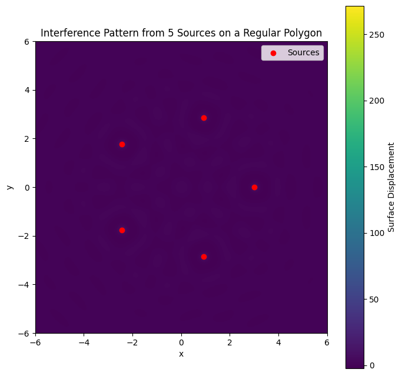
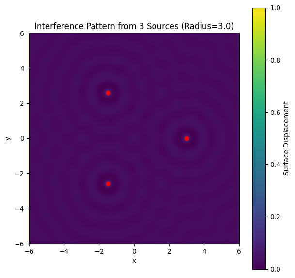

# Problem 1 # Problem 1: Interference Patterns on a Water Surface

## 1. Introduction and Motivation

When waves from multiple sources meet on a water surface, they interfere with each other, producing complex patterns. These patterns consist of regions where the waves reinforce each other (constructive interference) and regions where they cancel out (destructive interference).

Studying these interference patterns helps us understand fundamental wave behaviors, including superposition, phase differences, and coherence. Using simple water waves provides a clear visual example of these concepts.

## 2. Theoretical Background

### 2.1 Wave from a Single Point Source

The displacement of a water surface wave from a single point source located at $(x_0, y_0)$ is described by:

$$
\eta(x,y,t) = \frac{A}{r} \cos(kr - \omega t + \phi)
$$

where:

- $\eta(x,y,t)$ is the displacement at point $(x,y)$ and time $t$,
- $A$ is the amplitude of the wave,
- $r = \sqrt{(x - x_0)^2 + (y - y_0)^2}$ is the distance from the source to the point,
- $k = \frac{2\pi}{\lambda}$ is the wave number ($\lambda$ is the wavelength),
- $\omega = 2\pi f$ is the angular frequency ($f$ is the frequency),
- $\phi$ is the initial phase of the wave.

The $\frac{1}{r}$ term reflects that the wave amplitude decreases with distance from the source due to spreading.

### 2.2 Multiple Sources and Superposition

When multiple sources are present (placed at the vertices of a regular polygon), each emits a similar wave. The resulting displacement at any point is the sum of the displacements caused by each source (principle of superposition):

$$
\eta_{\text{sum}}(x,y,t) = \sum_{i=1}^N \frac{A}{r_i} \cos(k r_i - \omega t + \phi_i)
$$

where:

- $N$ is the number of sources (vertices),
- $r_i = \sqrt{(x - x_i)^2 + (y - y_i)^2}$ is the distance from the $i^{th}$ source at $(x_i, y_i)$ to the point $(x,y)$,
- $\phi_i$ is the initial phase of the $i^{th}$ source (often zero or constant for coherent sources).

## 3. Choosing the Polygon and Source Positions

### 3.1 Regular Polygon Choice

For simplicity, common regular polygons are:

- Equilateral triangle (3 sources),
- Square (4 sources),
- Regular pentagon (5 sources).

The polygon’s vertices can be positioned on a circle centered at the origin, with radius $R$, so that each vertex coordinates $(x_i, y_i)$ are:

$$
x_i = R \cos\left(\frac{2\pi (i-1)}{N}\right), \quad
y_i = R \sin\left(\frac{2\pi (i-1)}{N}\right), \quad
i = 1, 2, \dots, N
$$

## 4. Analysis of Interference Patterns

### 4.1 Constructive Interference

Occurs when waves arrive in phase (phase difference is multiple of $2\pi$). At these points:

$$
k r_i - \omega t + \phi_i = k r_j - \omega t + \phi_j + 2 m \pi, \quad m \in \mathbb{Z}
$$

The amplitudes add, resulting in amplified displacement (bright fringes or ripple crests).

### 4.2 Destructive Interference

Occurs when waves arrive out of phase by $\pi$ (odd multiples of $\pi$):

$$
k r_i - \omega t + \phi_i = k r_j - \omega t + \phi_j + (2 m + 1) \pi, \quad m \in \mathbb{Z}
$$

The waves cancel each other, producing minimal displacement (dark fringes or troughs).

## 5. Expected Patterns for Different Polygons

- **Triangle (3 sources):** The interference pattern typically shows threefold symmetry with alternating bright and dark regions between the vertices.

- **Square (4 sources):** Fourfold symmetric interference pattern with pronounced nodal (destructive) and antinodal (constructive) lines intersecting.

- **Pentagon (5 sources):** More complex fivefold symmetric pattern, showing intricate constructive/destructive zones.

## 6. Practical Considerations

All sources emit waves of equal amplitude $A$, equal frequency $f$, and same initial phase $\phi_i = 0$ (coherent sources).

The wavelength $\lambda$ and frequency $f$ determine how closely spaced the interference fringes are.

The radius $R$ of the polygon influences spacing between sources and thus the spatial pattern scale.

The waves diminish in amplitude with distance ($1/r$ factor), so interference effects are strongest near the sources.

## 7. Visualization (Conceptual)

By plotting $\eta_{\text{sum}}(x,y,t)$ over a 2D grid at a fixed time $t$, one obtains a map of water surface displacement:

- Bright spots or lines = constructive interference.
- Dark spots or lines = destructive interference.

Symmetry matches the polygon shape.

## 8. Summary

The interference pattern results from superposing waves from multiple point sources.

The pattern’s symmetry corresponds to the regular polygon arrangement of the sources.

Constructive interference occurs where the path differences are multiples of the wavelength.

Destructive interference occurs where path differences correspond to half-wavelength shifts.

Understanding and analyzing these patterns provides insight into wave phenomena in optics, acoustics, and fluid dynamics.

## colab 

[problems](https://colab.research.google.com/drive/1iBWUYRk0QN1CEQ_U9ZlV32IZq9PVSaLw?usp=sharing)

