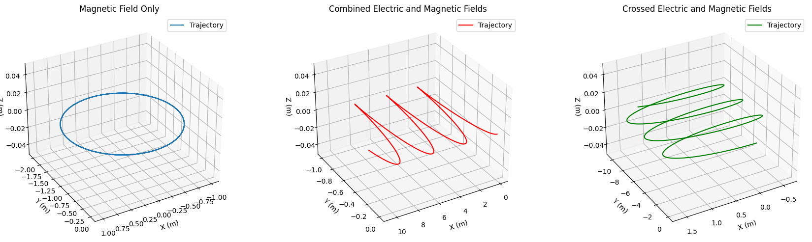

# Problem 1  # Problem 1: Simulating the Effects of the Lorentz Force

## 1. Introduction and Motivation
The Lorentz force governs how charged particles move when subjected to electric and magnetic fields. It is fundamental in understanding phenomena in plasma physics, designing particle accelerators, mass spectrometers, and confining charged particles in magnetic traps.

The force is expressed as:

$$
\mathbf{F} = q \mathbf{E} + q \mathbf{v} \times \mathbf{B}
$$

Where:

- $q$ is the particle’s electric charge,
- $\mathbf{E}$ is the electric field vector,
- $\mathbf{v}$ is the particle velocity vector,
- $\mathbf{B}$ is the magnetic field vector,
- $\times$ denotes the vector cross product.

## 2. Applications of the Lorentz Force

### 2.1 Particle Accelerators
Magnetic and electric fields are used to steer and accelerate charged particles to high speeds.

- Magnetic fields bend particle trajectories into circular or helical paths (cyclotrons, synchrotrons).
- Electric fields provide acceleration or energy modulation.

### 2.2 Mass Spectrometers
Charged particles with different mass-to-charge ratios follow different trajectories under magnetic fields, enabling separation and analysis.

### 2.3 Plasma Confinement
Magnetic fields confine charged plasma particles in devices like tokamaks or magnetic bottles, crucial for fusion research.

Crossed electric and magnetic fields can create drift motions affecting plasma stability.

## 3. Simulating Particle Motion Under Lorentz Force
The motion of a charged particle is governed by Newton’s second law combined with the Lorentz force:

$$
m \frac{d \mathbf{v}}{d t} = q \mathbf{E} + q \mathbf{v} \times \mathbf{B}
$$

where $m$ is the particle mass.

This equation can be solved numerically to find the particle trajectory $\mathbf{r}(t)$.

### 3.1 Uniform Magnetic Field Only
When $\mathbf{E} = 0$ and $\mathbf{B} \neq 0$, the particle experiences a magnetic force perpendicular to its velocity.

The particle moves in a circular path perpendicular to the magnetic field.

The radius of the circle is the Larmor radius:

$$
r_L = \frac{m v_{\perp}}{|q| B}
$$

where $v_{\perp}$ is the component of velocity perpendicular to $\mathbf{B}$.

The particle’s angular frequency (cyclotron frequency) is:

$$
\omega_c = \frac{|q| B}{m}
$$

### 3.2 Combined Uniform Electric and Magnetic Fields
With $\mathbf{E} \neq 0$ and $\mathbf{B} \neq 0$, the motion can become a helix if velocity has a component along $\mathbf{B}$.

- Electric field causes acceleration along its direction.
- Particle trajectory is a combination of circular motion (due to $\mathbf{B}$) and drift motion (due to $\mathbf{E}$).

### 3.3 Crossed Electric and Magnetic Fields ($\mathbf{E} \perp \mathbf{B}$)
The particle experiences a drift called the $\mathbf{E} \times \mathbf{B}$ drift.

This drift velocity is given by:

$$
\mathbf{v}_d = \frac{\mathbf{E} \times \mathbf{B}}{B^2}
$$

The particle moves in a circular path around the magnetic field, but the center of the circle itself drifts at velocity $\mathbf{v}_d$ perpendicular to both $\mathbf{E}$ and $\mathbf{B}$.

## 4. Parameter Exploration and Effects
- Charge $q$ and mass $m$: Affect radius and frequency of motion; heavier particles or smaller charges yield larger orbits and slower cyclotron frequencies.
- Magnetic field strength $B$: Increasing $B$ decreases the Larmor radius, tightening the circular path.
- Electric field strength $E$: Affects drift speed and acceleration along $\mathbf{E}$.
- Initial velocity $\mathbf{v}$: Determines the shape of trajectory (pure circular if velocity is perpendicular to $\mathbf{B}$; helical if there is a velocity component along $\mathbf{B}$).

## 5. Visualization of Particle Trajectories
- 2D plots can show circular or drifting orbits in the plane perpendicular to $\mathbf{B}$.
- 3D plots show helical trajectories combining circular motion and movement along $\mathbf{B}$.

Important features to highlight:

- Larmor radius — the radius of the circular orbit.
- Drift velocity — motion of orbit center in crossed fields.

## 6. Relation to Practical Systems
- Cyclotrons and synchrotrons use the circular motion induced by magnetic fields to accelerate particles repeatedly.
- Mass spectrometers rely on differences in particle trajectories in magnetic fields to identify mass-to-charge ratios.
- Magnetic traps and fusion devices utilize these forces to confine and control plasmas.

Understanding these trajectories is crucial to optimize particle control and confinement.

## 7. Extensions and Further Study
- Simulations can be extended to non-uniform fields where $\mathbf{E}$ and $\mathbf{B}$ vary spatially.
- Inclusion of radiation effects due to acceleration of charged particles.
- Study of collective effects in plasmas where many particles interact.
- Incorporation of relativistic effects for very high-speed particles.

## 8. Summary
The Lorentz force defines how charged particles move under electric and magnetic fields. By varying field strengths, initial velocity, and particle properties, one can observe circular, helical, and drift motions fundamental to many physical and technological applications.

Numerical simulations using methods like Euler or Runge-Kutta can visualize these complex trajectories, deepen understanding, and inform practical device design.

## colab 
[problems](https://colab.research.google.com/drive/1iBWUYRk0QN1CEQ_U9ZlV32IZq9PVSaLw?usp=sharing)