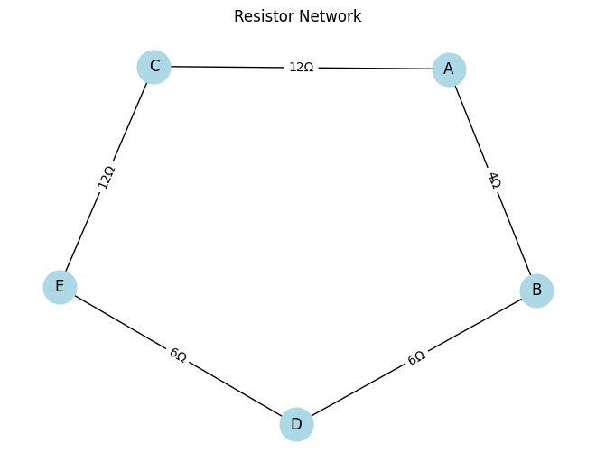
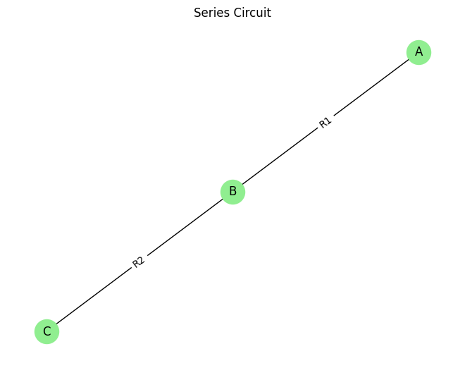
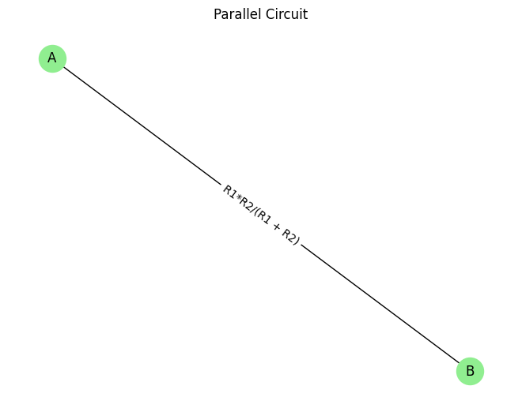
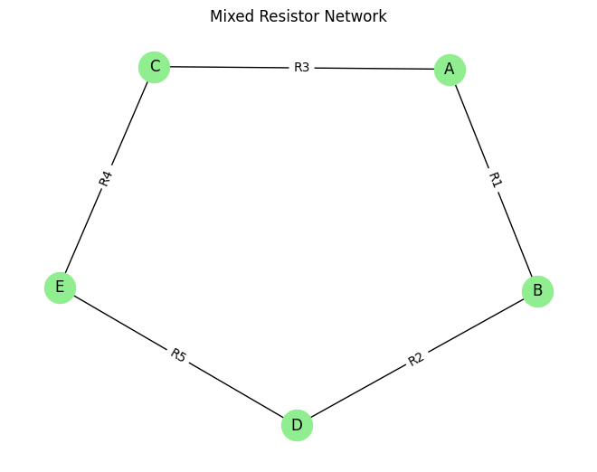

 # Problem 1 # Equivalent Resistance Using Graph Theory

Calculating equivalent resistance is a foundational problem in physics and electrical engineering. While simple series and parallel resistor combinations are easy to analyze by hand, more complex circuits can quickly become unmanageable. By applying graph theory, we can treat an electrical circuit as a mathematical graph where nodes (vertices) represent junctions and edges represent resistors weighted by their resistance values. This approach allows for a systematic process to reduce complex resistor networks to a single equivalent resistance between two terminals, useful in automation, simulation, and circuit optimization.

**Key Concepts:**

1. **Series Connection:** Two resistors are in series if they are connected end-to-end with no branching, carrying the same current. The equivalent resistance is given by
$$R_{eq} = R_1 + R_2 + \dots + R_n.$$

3. **Parallel Connection:** Two or more resistors are in parallel if they connect the same two nodes and share the same voltage. The equivalent resistance is given by
$$\frac{1}{R_{eq}} = \frac{1}{R_1} + \frac{1}{R_2} + \dots + \frac{1}{R_n}.$$

**Graph Theory Approach:**

- Represent the circuit as a graph with vertices as junctions and edges as resistors weighted by resistance.
- Given a graph and two terminals (start and end nodes):
  - Identify series connections by locating nodes connected to exactly two others (excluding terminals) and collapse them by summing resistances.
  - Identify parallel connections by finding multiple edges between the same two nodes and combine them using the parallel rule.
- Iteratively reduce the graph by simplifying series and parallel components until only one edge remains between the terminals.
- The weight of this final edge is the equivalent resistance.

**Examples:**

- *Simple Series:*  
  Circuit: \( A \xrightarrow{5\Omega} B \xrightarrow{10\Omega} C \)  
  Node \( B \) connects two resistors in series, so  
  $$\[
  R_{eq} = 5 + 10 = 15 \Omega.
  \]$$

- *Simple Parallel:*  
  Circuit with two resistors between \( A \) and \( B \): 10Ω and 20Ω in parallel,  
  $$\[
  \frac{1}{R_{eq}} = \frac{1}{10} + \frac{1}{20} = \frac{3}{20} \implies R_{eq} = \frac{20}{3} \approx 6.67 \Omega.
  \]$$

- *Mixed/Nested Circuit:*  
  Given connections:  
  \( A \to B = 4\Omega \), \( B \to D = 6\Omega \), \( A \to C = 12\Omega \), \( C \to E = 12\Omega \), and \( D \to E = 6\Omega \).  
  Simplify series: \( B-D = 10 \Omega \), \( C-E = 24 \Omega \).  
  Paths from \( A \) to \( E \) are in parallel:  
  $$\[
  \frac{1}{R_{eq}} = \frac{1}{16} + \frac{1}{24} = \frac{5}{48} \implies R_{eq} = \frac{48}{5} = 9.6 \Omega.
  \] $$

**Advantages:** The graph-based method scales to complex circuits, is systematic, automatable, and visually intuitive. For larger circuits, node degree checks help detect series connections and edge multiplicity detects parallel connections, allowing iterative reduction.

**Applications:** Useful in circuit design, simulation software (e.g., SPICE), network reliability, PCB optimization, and energy distribution.

**Conclusion:** Applying graph theory to calculate equivalent resistance is a powerful and practical approach for analyzing complex resistor networks, enabling efficient and automated circuit analysis beyond simple manual methods.

## colab 
[problems](https://colab.research.google.com/drive/1iBWUYRk0QN1CEQ_U9ZlV32IZq9PVSaLw?usp=sharing)