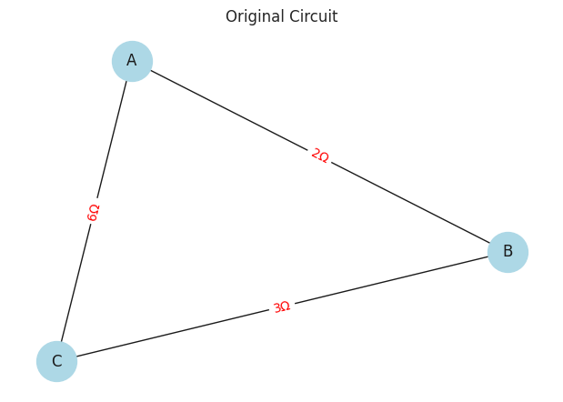
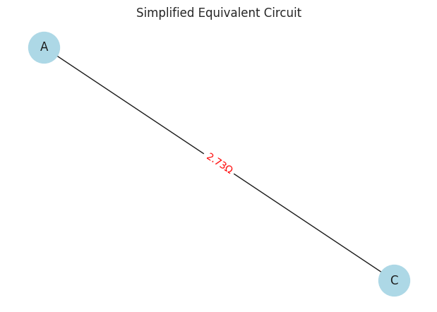

 # Problem 1 ## Problem 1: Equivalent Resistance Using Graph Theory (Non-Programming Solution)

### Motivation

Calculating equivalent resistance in complex circuits using classical series and parallel rules becomes tedious.

Graph theory offers a powerful, systematic way to model and simplify any resistor network.

In this approach, a circuit is represented as a graph, where:

- **Nodes** correspond to electrical junctions.
- **Edges** correspond to resistors, with weights equal to their resistance values.

By analyzing the graph structure, we can iteratively simplify the circuit until a single equivalent resistance is found between two terminals.

This method is useful for automated analysis and deeper theoretical understanding.

---

### Conceptual Overview of the Algorithm

#### Model the Circuit as a Graph

- Represent each connection point (junction) in the circuit as a **node**.
- Represent each resistor as an **edge** connecting two nodes.
- The weight of each edge is the resistor’s resistance value.

#### Identify Simplifiable Structures

- **Series connections**: Occur when a node (other than the terminals) connects exactly two resistors in a chain, without branching.
- **Parallel connections**: Occur when two or more resistors connect the same pair of nodes (forming parallel edges).

#### Iterative Reduction

- **Series Reduction**: When a node connects exactly two edges in series, combine the two resistors by adding their resistances, remove the intermediate node, and replace the two edges with a single edge representing the combined resistance:

  $$
  R_{\text{eq}} = R_1 + R_2
  $$

- **Parallel Reduction**: When multiple edges connect the same two nodes, replace them with a single edge whose resistance is the reciprocal of the sum of reciprocals of the individual resistances:

  $$
  \frac{1}{R_{\text{eq}}} = \sum \frac{1}{R_i}
  $$

- Replace multiple edges with a single edge of resistance $R_{\text{eq}}$.

#### Repeat the Process

- After each reduction step, new series or parallel structures might emerge.
- Continue applying series and parallel reductions iteratively until only one equivalent resistor remains between the two terminals.

---

### Handling Nested and Complex Circuits

- Circuits often contain **nested combinations**: parts of the network where series and parallel configurations are mixed.
- The iterative nature of the graph-based approach naturally handles these complex nested configurations.
- Each simplification step may expose new series or parallel structures, allowing gradual reduction of the circuit.
- No manual detection of nested configurations is required; the algorithm systematically finds and reduces all possible structures.

---

### Step-by-Step Method (Conceptual)

1. Start with the original circuit graph.
2. Find all nodes (excluding terminals) with exactly two connections (degree 2).
3. Such nodes usually indicate series-connected resistors.
4. Combine those two resistors by summing their resistances:

   $$
   R_{\text{eq}} = R_1 + R_2
   $$

5. Remove the intermediate node, connect its neighbors directly.
6. Find pairs of nodes connected by multiple resistors (parallel edges).
7. Combine parallel resistors by calculating equivalent resistance using the reciprocal formula:

   $$
   \frac{1}{R_{\text{eq}}} = \frac{1}{R_1} + \frac{1}{R_2}
   $$

8. Replace multiple edges with a single edge of resistance $R_{\text{eq}}$.
9. Repeat Steps 2 and 3.
10. Iterate until the circuit is reduced to a single edge between the two terminals.
11. The resistance of this single edge is the equivalent resistance.

---

### Examples

#### Simple Series

Two resistors $R_1$ and $R_2$ connected one after another.

- Equivalent resistance:

  $$
  R_{\text{eq}} = R_1 + R_2
  $$

#### Simple Parallel

Two resistors $R_1$ and $R_2$ connected across the same nodes.

- Equivalent resistance:

  $$
  \frac{1}{R_{\text{eq}}} = \frac{1}{R_1} + \frac{1}{R_2}
  $$

#### Nested Configuration

- A parallel branch containing series resistors or vice versa.
- The iterative reduction method simplifies inner parts first, then combines results.

---

### Efficiency and Practical Considerations

**Advantages**:

- Systematic and algorithmic: good for computer implementation.
- Handles complex circuits that are difficult to analyze manually.
- Useful in circuit simulation and design software.

**Limitations**:

- The method depends on correctly identifying series and parallel structures.
- Some very complex networks (like those with bridges or non-reducible meshes) require more advanced transformations (e.g., Y-Δ transformations).
- Computational cost grows with network size but remains manageable for typical circuits.

---

### Summary

- Using graph theory, circuits can be represented as weighted graphs.
- Equivalent resistance is found by iterative simplification:
  - **Series reductions** combine resistors connected in a chain.
  - **Parallel reductions** combine resistors sharing the same nodes.
- Nested and complex circuits are simplified stepwise without special manual handling.
- This approach bridges electrical engineering and graph theory, offering powerful insight and practical tools for circuit analysis.

---

## colab 
[problems](https://colab.research.google.com/drive/1iBWUYRk0QN1CEQ_U9ZlV32IZq9PVSaLw?usp=sharing)